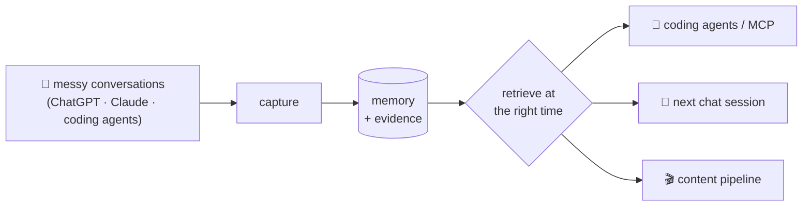

<picture>
  <source media="(prefers-color-scheme: dark)" srcset="assets/banner-dark.svg">
  
</picture>

  
  
  
  

I build tools for the part of AI work that breaks after the demo: fragmented context, changing state, hidden effort, unclear positioning, and the gap between thinking and action.

**Now:** Founding engineer at [Iditor](https://yeahecho.com) (EchoMemory) — cross-platform AI memory across iOS, web, Chrome extension, and MCP/agent workflows. BU Computer Science '25.

My current focus is simple:

> Turn messy human context into memory, judgment, and reusable agent behavior.

---

## 🧭 Current Thesis

AI can generate more output than people can judge.

So the bottleneck moves to:

- what context should be preserved
- what changed since last time
- what evidence supports the answer
- what mode is safe next
- what identity a repeated behavior is reinforcing
- what one sentence makes the work understandable

I am interested in AI systems that do not only answer the current prompt, but help people carry context forward.

---

## 🛠️ Public Agent Skills

Small installable skills that turn personal systems into reusable agent behavior.

| Skill | What it does |
|---|---|
| 🪞 [identity-votes](https://github.com/myfeng10/identity-votes) | Turns ordinary self-talk into identity votes, pattern reads, and one high-ROI next action. |
| 🔋 [next-mode](https://github.com/myfeng10/next-mode) | Reads hidden effort from AI-assisted work and chooses the next safe mode: push, switch, recover, or stop. |
| 🎯 [one-shot-positioning](https://github.com/myfeng10/one-shot-positioning) | Turns messy work into a 10-second intro, proof stack, hard-part answer, and one sentence to memorize. |
| 🤝 [smart-people-prep](https://github.com/myfeng10/smart-people-prep) | Prepares high-context conversations with one sharp intro, proof, a strong question, pushback practice, and follow-up. |

The thread: less tracking overhead, more decisive support.

---

## ⚙️ Personal Operating Systems

Some repos are public projects; some are private workspaces. I still treat them as part of my GitHub map because they capture how I work, what I am building toward, and what future agents should not miss.

| Project | What it does |
|---|---|
| [thinking-video-pipeline](https://github.com/myfeng10/thinking-video-pipeline) | Local video-editing pipeline that turns raw thinking videos into transcripts, edit plans, rough cuts, marker-based edits, and burned-in captions. The point is to capture real thinking first, then use AI and lightweight tools to make it legible. |
| ResumeWorkspace (private workspace) | Personal job-search operating system: source-of-truth profile, job tracking, role-specific resume variants, application materials, and agent instructions for turning raw career context into targeted positioning. |

The thread: turn messy personal context into systems that preserve judgment, reduce repeated effort, and make the next action easier.

---

## 🧠 Memory And Context Work

I work on cross-platform AI memory: capturing real AI conversations and turning them into retrievable context with evidence.

The interesting part is not storing more text. It is making AI able to answer:

> What do we know, why do we know it, when was it true, and what should be reused now?

Current product questions I care about:

- How should AI preserve live context without over-compressing away taste?
- When does a conversation become memory instead of just transcript?
- How can human discussion become implementation context for another agent?
- How should assistants behave when they can actually save, route, and reuse context?
- How do privacy and trust change the design of memory products?

---

## 📄 Research

Co-author on two papers from undergrad research at BU:

- [Explore Reinforced](https://arxiv.org/abs/2412.02016) — equilibrium approximation with reinforcement learning; accepted at GameSec 2025.
- [DebiasPI](https://arxiv.org/abs/2501.18642) — inference-time debiasing of text-to-image generative models by prompt iteration; presented at an ECCV 2024 workshop.

What research left me with: the habit of breaking a fuzzy problem down until it can be measured — which is most of what evaluation work on memory systems actually is.

---

<b>🌱 Older Roots</b> — undergrad projects (algorithms, planning, data, full-stack)

 

- [CompetitiveProgramming](https://github.com/myfeng10/CompetitiveProgramming) - programming problem solutions and algorithm practice.
- [PlannerX-www](https://github.com/myfeng10/PlannerX-www) - course-planning frontend for student academic planning.
- [HighestTempPrediction](https://github.com/myfeng10/HighestTempPrediction) - weather-data aggregation and prediction.
- SportPal - community sports event web app work.

They are older, but they still matter. The throughline was already there: take something hard to track, and make it legible enough for someone else to use.

---

## 🚀 Direction

I am building toward AI memory, context engineering, agent workflows, and human-centered tools for self-management and communication.

The long-term bet:

> The best AI products will not just produce more output. They will help people preserve context, make better judgments, and act with clearer timing.
