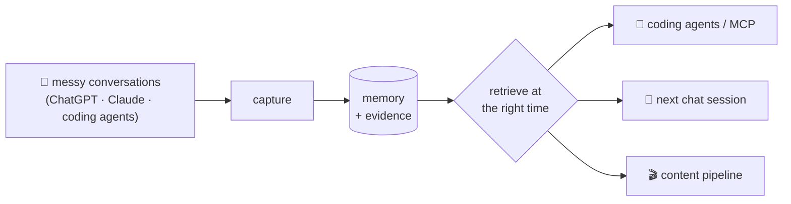

<picture>
  <source media="(prefers-color-scheme: dark)" srcset="assets/banner-dark.svg">
  
</picture>

<p>
  <a href="https://www.myfeng10.com/"></a>
  <a href="https://www.linkedin.com/in/michelle-yilin-feng/"></a>
  <a href="mailto:myfeng10d@gmail.com"></a>
  <a href="https://yeahecho.com"></a>
</p>

I build tools for three moments that usually stay messy: carrying context forward, deciding what to do next, and explaining real work clearly.

**Now:** Founding engineer at [Iditor](https://yeahecho.com) (EchoMemory) — cross-platform AI memory across iOS, web, Chrome extension, and MCP/agent workflows. BU Computer Science '25.

---

## 🧭 Start with the moment you are in

These are not prompt collections. Each skill takes one recognizable situation and returns one bounded decision or artifact.

An agent skill is an installable behavior contract. Add it to a compatible agent with `npx skills add`, restart the agent, then invoke it in an ordinary message with `$skill-name`.

Every **see it work** link below opens a real user prompt, the old skill's actual response, the current skill's actual response, and the full recorded outputs.

### Decide and reflect

| If you are thinking… | Use | What comes back |
|---|---|---|
| “I have already spent a full day supervising AI. Is another deep-work block actually safe?” | [`next-mode`](https://github.com/myfeng10/next-mode) · [see it work](skill-examples/next-mode.md) | One mode—push, switch, recover, or stop—plus the exact next block. |
| “Across these days or weeks, what identity did my repeated choices reinforce?” | [`identity-votes`](https://github.com/myfeng10/identity-votes) · [see it work](skill-examples/identity-votes.md) | An evidence-calibrated trajectory and one next vote. |
| “What did today's ordinary choices vote for?” | [`identity-vote-translator`](https://github.com/myfeng10/agentic-self-management-skills/tree/main/skills/identity-vote-translator) · [see it work](skill-examples/identity-vote-translator.md) | A lightweight behavior read without turning one day into a personality label. |
| “Given my sleep, meetings, food, and workload, what is one safe action now?” | [`energy-decision-support`](https://github.com/myfeng10/agentic-self-management-skills/tree/main/skills/energy-decision-support) · [see it work](skill-examples/energy-decision-support.md) | One capacity-based action and one bounded fallback. |
| “What should I protect, try, and avoid next week?” | [`weekly-trajectory-review`](https://github.com/myfeng10/agentic-self-management-skills/tree/main/skills/weekly-trajectory-review) · [see it work](skill-examples/weekly-trajectory-review.md) | One weekly pattern and exactly three decisions. |
| “How do I preserve why this project mattered for future me?” | [`living-archive-entry-builder`](https://github.com/myfeng10/agentic-self-management-skills/tree/main/skills/living-archive-entry-builder) · [see it work](skill-examples/living-archive-entry-builder.md) | A durable archive entry that preserves the event, change, and future-self lesson. |

### Explain and connect

| If you are thinking… | Use | What comes back |
|---|---|---|
| “This project is real, but my explanation is a component list.” | [`one-shot-positioning`](https://github.com/myfeng10/one-shot-positioning) · [see it work](skill-examples/one-shot-positioning.md) | A 10-second explanation led by the hard problem, proof, and one line to remember. |
| “I have 15 minutes with someone senior and tend to over-explain.” | [`smart-people-prep`](https://github.com/myfeng10/smart-people-prep) · [see it work](skill-examples/smart-people-prep.md) | One intro, one question, honest proof, pushback practice, and a follow-up bridge. |
| “I need to contact this person for a real reason without sounding automated.” | [`write-high-signal-outreach`](https://github.com/myfeng10/write-high-signal-outreach) · [see it work](skill-examples/write-high-signal-outreach.md) | One evidence-backed argument, one contribution surface, and one answerable ask. |

→ [Browse all nine worked examples](skill-examples/README.md)

Each worked example ends with its exact install command and a prompt you can copy. For example:

```bash
npx skills add myfeng10/next-mode
npx skills add myfeng10/agentic-self-management-skills --skill identity-vote-translator
```

---

## 🔎 One real project, end to end

The [EchoMem Group outreach research pack](case-studies/echomem-outreach-research/README.md) shows what the outreach workflow looks like beyond one email:

`public pain signal → lead score → why now → message rubric → discovery → 3–5 person pilot`

It includes the actual ICP rubric, outreach rubric, playbook, message library, research notes, and lead tracker. The product idea is concrete: **share useful team context, not everyone's full AI conversation history.**

---

## 🧪 Evidence behind the examples

<p>
  <a href="skills-evaluation.md"></a>
  <a href="skills-evaluation.md"></a>
  <a href="skills-evaluation.md"></a>
  <a href="skills-evaluation.md"></a>
</p>

I freeze a user situation and acceptance criteria, run the old skill, revise the behavior contract, run the same situation again, and judge both outputs blindly. The examples above show the product; the [evaluation note](skills-evaluation.md) shows the evidence boundary.

---

## ⚙️ Personal Operating Systems

Some repos are public projects; some are private workspaces. I still treat them as part of my GitHub map because they capture how I work, what I am building toward, and what future agents should not miss.

| Project | What it makes durable |
|---|---|
| [memory-eval-results](https://github.com/myfeng10/memory-eval-results) | Benchmark runs, failure traces, and iteration evidence for memory retrieval and answer quality. |
| [model-knowledge](https://github.com/myfeng10/model-knowledge) | Prompt-change evidence promoted into reusable model insights, failure modes, and validated rules. |
| [thinking-video-pipeline](https://github.com/myfeng10/thinking-video-pipeline) | Raw thinking videos turned into transcripts, edit plans, rough cuts, marker edits, and burned-in captions. |
| ResumeWorkspace (private workspace) | Career evidence, job tracking, role-specific materials, and agent instructions kept in one operating system. |

The thread: turn messy personal context into systems that preserve judgment, reduce repeated effort, and make the next action easier.

---

## 🧠 Memory And Context Work

I work on cross-platform AI memory: capturing real AI conversations and turning them into retrievable context with evidence.


```mermaid
flowchart LR
    A["💬 messy conversations<br/>(ChatGPT · Claude · coding agents)"] --> B["capture"]
    B --> C[("memory<br/>+ evidence")]
    C --> D{"retrieve at<br/>the right time"}
    D --> E["🤖 coding agents / MCP"]
    D --> F["💭 next chat session"]
    D --> G["🎬 content pipeline"]
```

The interesting part is not storing more text. It is making AI able to answer:

> What do we know, why do we know it, when was it true, and what should be reused now?

Current product questions I care about:

- How should AI preserve live context without over-compressing away taste?
- When does a conversation become memory instead of just transcript?
- How can human discussion become implementation context for another agent?
- How should assistants behave when they can actually save, route, and reuse context?
- How do privacy and trust change the design of memory products?

---

## 📄 Research

Co-author on two papers from undergrad research at BU:

- [Explore Reinforced](https://arxiv.org/abs/2412.02016) — equilibrium approximation with reinforcement learning; accepted at GameSec 2025.
- [DebiasPI](https://arxiv.org/abs/2501.18642) — inference-time debiasing of text-to-image generative models by prompt iteration; presented at an ECCV 2024 workshop.

What research left me with: the habit of breaking a fuzzy problem down until it can be measured — which is most of what evaluation work on memory systems actually is.

---

<details>
<summary><b>🌱 Older Roots</b> — undergrad projects (algorithms, planning, data, full-stack)</summary>
<br>

- [CompetitiveProgramming](https://github.com/myfeng10/CompetitiveProgramming) - programming problem solutions and algorithm practice.
- [PlannerX-www](https://github.com/myfeng10/PlannerX-www) - course-planning frontend for student academic planning.
- [HighestTempPrediction](https://github.com/myfeng10/HighestTempPrediction) - weather-data aggregation and prediction.
- SportPal - community sports event web app work.

They are older, but they still matter. The throughline was already there: take something hard to track, and make it legible enough for someone else to use.

</details>

---

## 🚀 Direction

I am building toward AI memory, context engineering, agent workflows, and human-centered tools for self-management and communication.

The long-term bet:

> The best AI products will not just produce more output. They will help people preserve context, make better judgments, and act with clearer timing.
